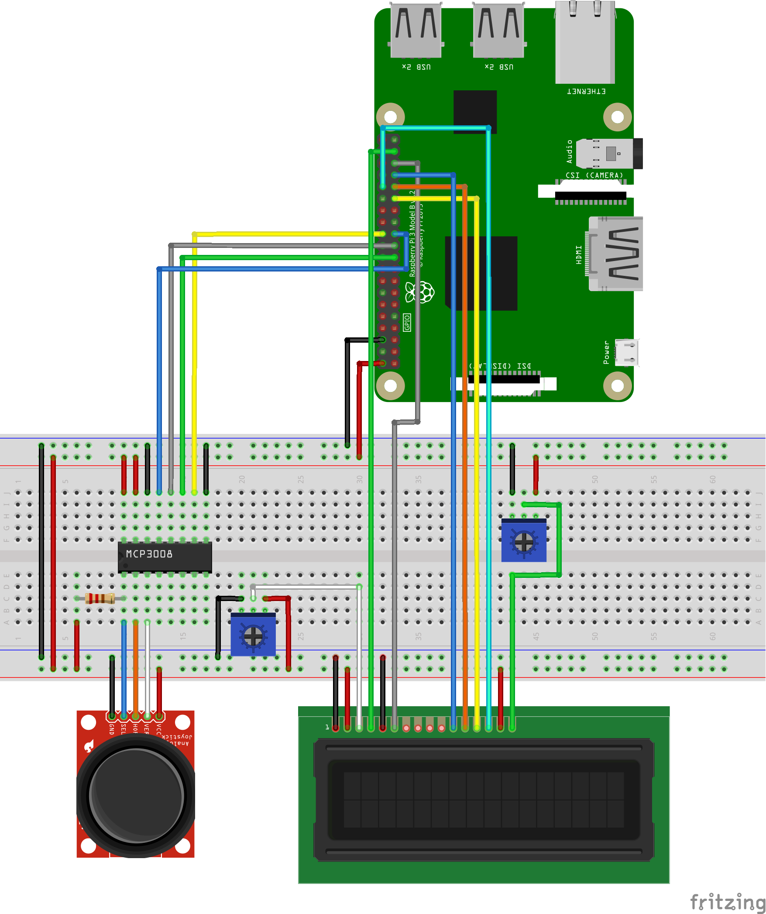

# Interfacing a Joystick Module on the Raspberry Pi 3 using an MCP3008

### INTRODUCTION:
This instruction manual will guide you on how to interface a Joystick Module on the Raspberry Pi 3 using an MCP3008 ADC. As well as guiding you on setting up an LCD Display.

### OBJECTIVES:
*	To interface a **Joystick Module** into the Raspberry Pi 3

### MATERIALS NEEDED:
*	10kΩ Trim Pot – 2pcs
*	1kΩ Resistor 1/4W – 1pc
*	Jumper Wires
*	MCP3008
*	Joystick Module
*	Raspberry Pi 3

### PROCEDURES:
*	 Check SPI Interface if enabled.  
o	If disabled, refer to https://goo.gl/eCY4xo to enable SPI Interface
*	Follow wiring information.
*	Download Python Source Code:  
o	https://github.com/impire123/Raspberry-Pi-3-Joystick-with-MCP3008.git
*	Run code.

## WIRING DIAGRAM:

### Wiring Information
Joystick    |MCP3008/Pi
------------|------
GND (Ground)|Pi GPIO Pin 6 (Ground)
5V   (3.3V) |Pi GPIO Pin 1 (3.3V)
SW   (SEL)  |MCP3008 Pin 1 (CH0)
VRx  (HOR)  |MCP3008 Pin 2 (CH1)
VRy  (VER)  |MCP3008 Pin 3 (CH2)

MCP3008|Pi
-------|--
Pin 1  |(CH0)	N/C
Pin 2  |(CH1)	N/C
Pin 3  |(CH2)	N/C
Pin 9  |(DGND)	Pin 6 (GND)
Pin 10 |(CS)	Pin 24 (GPIO8)
Pin 11 |(DIN)	Pin 19 (GPIO10)
Pin 12 |(DOUT)	Pin 21 (GPIO9)
Pin 13 |(CLK)	Pin 23 (GPIO11)
Pin 14 |(AGND)	Pin 6 (GND)
Pin 15 |(VREF)	Pin 1 (3.3V)
Pin 16 |(VDD)	Pin 1 (3.3V)

LCD 16x2|Pi
--------|--
Pin 1   |(GND)	Pin 6 (GND)
Pin 2   |(VCC/5v)	Pin 2 (5V)
Pin 3   |(V0)	Pot Pin 2 
Pin 4   |(RS)	Pin 37 (GPIO26)
Pin 5   |(RW)	Pin 6 (GND)
Pin 6   |(EN)	Pin 35 (GPIO19)
Pin 11  |(D4)	Pin 33 (GPIO13)
Pin 12  |(D5)	Pin 31 (GPIO6)
Pin 13  |(D6)	Pin 29 (GPIO5)
Pin 14  |(D7)	Pin 32 (GPIO12)
Pin 15  |(LED+)	Pin 6 (GND)
Pin 16  |(LED-)	Pin 2 (5V)
